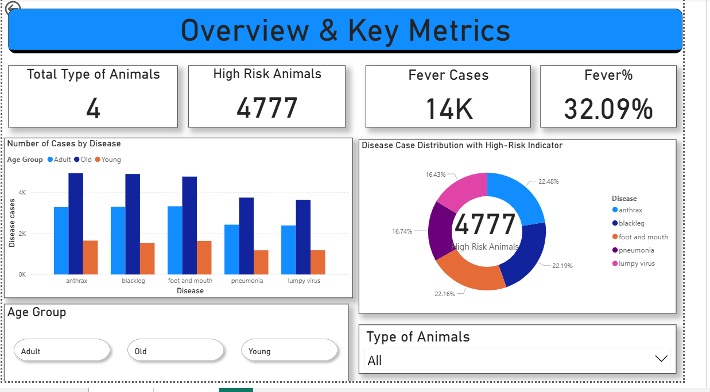
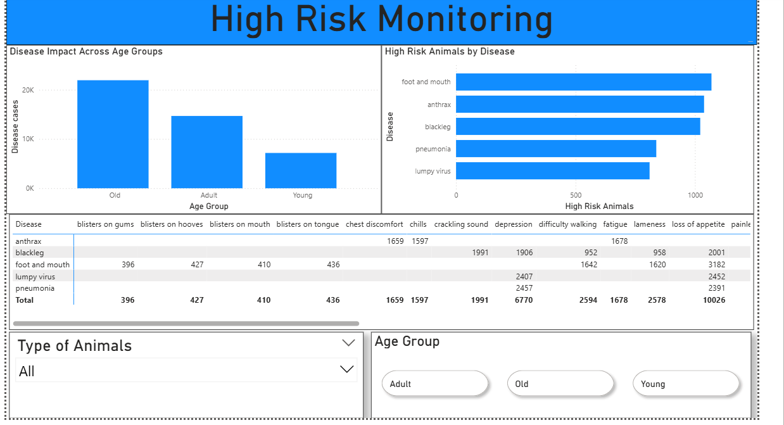

🐄 Cattle Disease Analysis & High-Risk Monitoring Dashboard

📊 Project Overview

The **Cattle Disease Analysis & High-Risk Monitoring Dashboard** is an interactive Power BI dashboard designed to analyze cattle disease cases and identify high-risk animals based on disease patterns and age groups.

The dashboard provides visual insights into disease distribution, fever cases, high-risk animals, and disease impact across different age groups.

🎯 Objectives

- Analyze cattle disease cases by disease type.
- Identify high-risk animals.
- Monitor fever cases and fever percentage.
- Analyze disease cases across different age groups.
- Compare disease impact between Adult, Old, and Young animals.
- Provide interactive filtering for disease and animal type.
- Present important disease indicators through an easy-to-understand dashboard.

🛠️ Tools & Technologies

- **Power BI**
- **Power Query**
- **DAX**
- **Microsoft Excel / CSV**
- **Data Visualization**
- **Data Analysis**
  
📌 Dashboard Features

 1. Overview & Key Metrics

The overview dashboard provides important KPIs such as:

- Total Types of Animals
- High-Risk Animals
- Fever Cases
- Fever Percentage
- Disease-wise Case Distribution
- High-Risk Disease Distribution
- Age Group Analysis
- Animal Type Filtering

2. High-Risk Monitoring

The high-risk monitoring page provides:

- Disease impact across age groups
- High-risk animals by disease
- Disease symptom/case distribution
- Age group filtering
- Animal type filtering

---

📷 Dashboard Preview

### Overview & Key Metrics

### High-Risk Monitoring

📈 Key Dashboard Metrics

| Metric | Description |
|---|---|
| Total Animal Types | Number of animal categories available in the dataset |
| High-Risk Animals | Number of animals identified as high risk |
| Fever Cases | Total recorded fever cases |
| Fever % | Percentage of cases associated with fever |
| Disease Cases | Number of cases grouped by disease |
| Age Group | Analysis of Adult, Old, and Young animals |

---

🦠 Diseases Analyzed

The dashboard currently analyzes diseases including:

- Anthrax
- Blackleg
- Foot and Mouth Disease
- Pneumonia
- Lumpy Virus

👥 Age Groups

The analysis includes three major age groups:

- Adult
- Old
- Young

Users can interact with the dashboard using the age-group filters to examine disease patterns for different groups.

🔍 Dashboard Insights

The dashboard enables users to:

- Identify diseases with higher numbers of cases.
- Compare disease cases across age groups.
- Examine high-risk animals by disease.
- Analyze symptoms associated with different diseases.
- Monitor fever-related cases.
- Filter the analysis based on animal type and age group.

